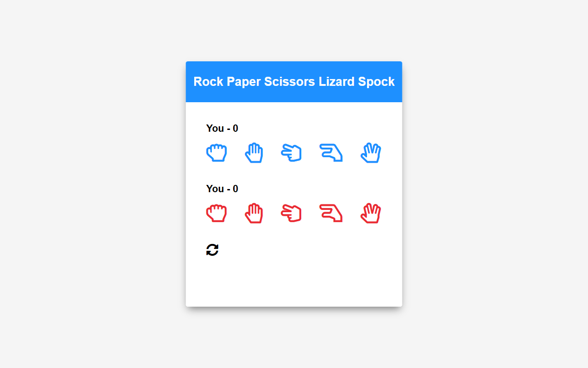

# Spock Rock Game | ZTM JS Web Projects Course

**Project 13/20**

🎮 Spock Rock Game is an extended version of the classic Rock-Paper-Scissors game — inspired by *The Big Bang Theory* — now featuring **Lizard** and **Spock** as additional choices. With smooth UI, real-time score tracking, and a celebratory confetti animation when you win, this project is built entirely with Vanilla JS and styled to work across devices.

---

## 📚 Table of Contents

- [🔎 Overview](#-overview)
  - [📸 Screenshot](#-screenshot)
  - [🔗 Links](#-links)
  - [📌 Features](#-features)
  - [🛠️ Built with](#️-built-with)
- [🧠 My process](#-my-process)
  - [🗃️ Useful resources](#️-useful-resources)
  - [🔙 Previous Project](#-previous-project)
  - [🔜 Next Project](#-next-project)
- [👤 Author](#-author)
  - [🌐 Connect with Me](#-connect-with-me)
  - [💻 Coding Profiles](#-coding-profiles)

---

## 🔎 Overview

### 📸 Screenshot

### 🔗 Links

- [🔴 Live Demo](https://dalascript.github.io/spock-rock-game/)
- [🗂️ GitHub Repository](https://github.com/DalaScript/spock-rock-game)

### 📌 Features

- ✅ 5-choice gameplay: Rock, Paper, Scissors, Lizard, Spock
- ✅ Click-based controls with immediate visual feedback
- ✅ Real-time score updates for both player and computer
- ✅ Dynamic result messaging (win, lose, tie)
- ✅ Confetti animation when the player wins 🎉
- ✅ Clean reset functionality to start over anytime
- ✅ Visual "selected" highlight for both player and computer choices
- ✅ Fully responsive and mobile-friendly layout

### 🛠️ Built with

- HTML5
- CSS3
- Vanilla JavaScript
- Confetti.js

---

## 🧠 My Process

### 🗃️ Useful resources

- [Big Bang Theory Video Clip - RPSLS](https://www.youtube.com/watch?v=405Nh2H4Ucg) – Fun origin of the 5-option game logic  
- [FontAwesome Icons](https://fontawesome.com/icons?d=gallery&q=close&m=free) – Free icons for UI elements
- [Google Fonts](https://fonts.google.com/) – Stylish fonts for modern UI
- [Confetti JS](https://www.cssscript.com/confetti-falling-animation/) – Lightweight confetti animation library
- [W3Schools - Switch](https://www.w3schools.com/js/js_switch.asp) – How to use switch statements
- [MDN - ES Modules](https://developer.mozilla.org/en-US/docs/Web/JavaScript/Guide/Modules) – Guide to JavaScript modules
- [JS Modules History Article](https://www.sitepoint.com/understanding-es6-modules-via-their-history/) – Article on the evolution of JS modules
- [JS Modules History Github](https://gist.github.com/branneman/558ef3a37ffd58ea004e00db5b201677) – Timeline of JavaScript module development

### 🔙 Previous Project

- Form Validator | *Project 12/20* → [View Repository](https://github.com/DalaScript/form-validator)

### 🔜 Next Project

- NASA APOD | *Project 14/20* → [View Repository](https://github.com/DalaScript/nasa-apod)

---

## 👤 Author

### 🌐 Connect with Me

- [Instagram](https://www.instagram.com/DalaScript)
- [YouTube](https://www.youtube.com/@DalaScript)

### 💻 Coding Profiles

- [freeCodeCamp](https://www.freecodecamp.org/DalaScript)
- [FrontendMentor](https://www.frontendmentor.io/profile/DalaScript)
- [GitHub](https://github.com/DalaScript)

*🙌 Thanks for checking out my project! More coming soon. Stay tuned 🚀*
